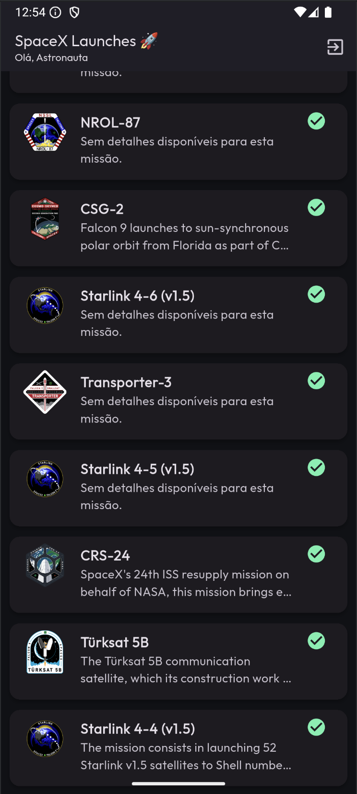
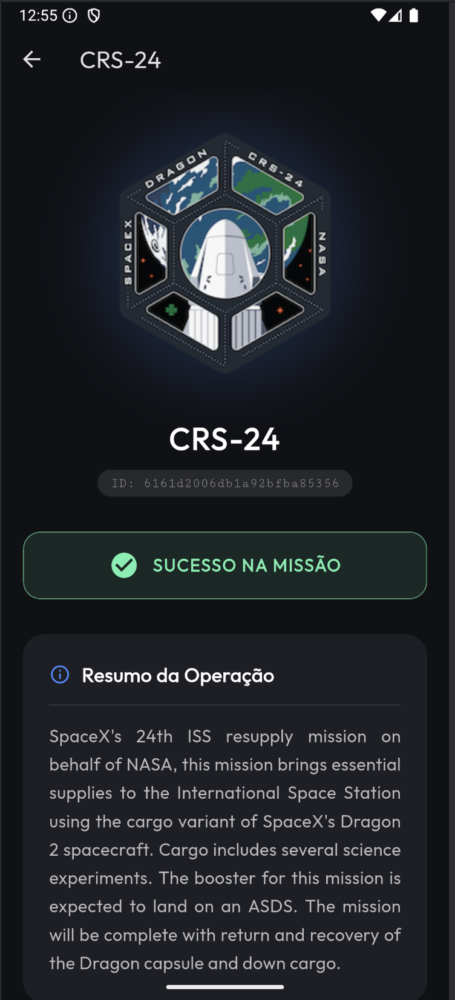

# 🚀 SpaceX Explorer

> Um aplicativo Flutter moderno e imersivo para explorar o histórico de missões da SpaceX, consumindo dados reais da API oficial.

## 📱 Sobre o Projeto

Este projeto foi desenvolvido como parte da disciplina de Desenvolvimento de Sistemas Móveis. O objetivo foi criar uma aplicação robusta que integrasse **Autenticação em Nuvem** (Firebase) com consumo de **API REST** externa, aplicando boas práticas de arquitetura e UI/UX.

O aplicativo apresenta um tema espacial escuro (**Dark Mode**), animações fluidas e tratamento de erros para uma experiência de usuário sólida.

## 📸 Screenshots

| Tela de Login | Tela de Cadastro | Lista de Lançamentos | Detalhes da Missão |
|:---:|:---:|:---:|:---:|
|  |  |  |  |

---

## ✨ Funcionalidades

- **🔐 Autenticação Segura:**
  - Login e Cadastro de usuários utilizando **Firebase Authentication** (Email/Senha).
  - Validação de formulários e feedback visual de erros.
  - Persistência de login (usuário continua logado ao reiniciar o app).

- **🚀 Integração com API SpaceX:**
  - Consumo da API v4 da SpaceX (`/launches/past`).
  - Listagem dos últimos lançamentos.
  - Indicadores visuais de sucesso ✅ ou falha ❌ da missão.

- **📱 Interface & UX:**
  - **Dark Mode Imersivo:** Design focado em tons escuros e neon.
  - **Pull-to-Refresh:** Atualização da lista arrastando a tela.
  - **Tela de Detalhes:** Exibição rica com Patch da missão, ID e descrição completa.

---

## 🛠 Tecnologias Utilizadas

- **[Flutter](https://flutter.dev/):** Framework principal.
- **[Firebase Auth](https://firebase.google.com/docs/auth):** Gerenciamento de identidade.
- **[HTTP](https://pub.dev/packages/http):** Requisições REST à API.
- **[Google Fonts](https://pub.dev/packages/google_fonts):** Tipografia moderna ('Outfit').
- **[Flutter Launcher Icons](https://pub.dev/packages/flutter_launcher_icons):** Ícone personalizado do app.

---

## 📂 Estrutura do Projeto

O código segue o padrão de separação de responsabilidades:

```text
lib/
├── models/         # Modelos de dados (Launch, User)
├── screens/        # Telas (Login, SignUp, Home, Details)
├── services/       # Lógica de API e Autenticação
└── main.dart       # Ponto de entrada e configuração do Tema
